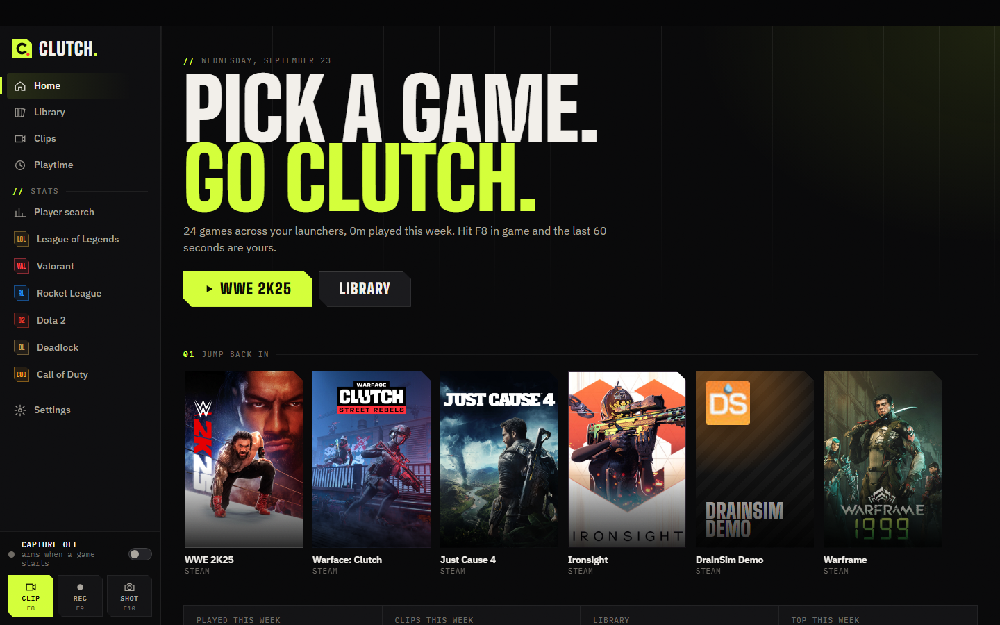
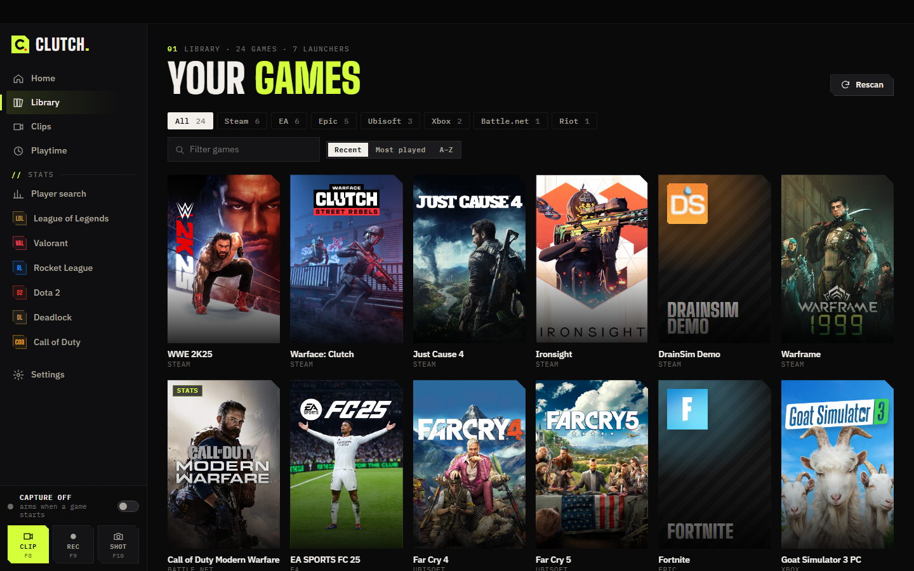
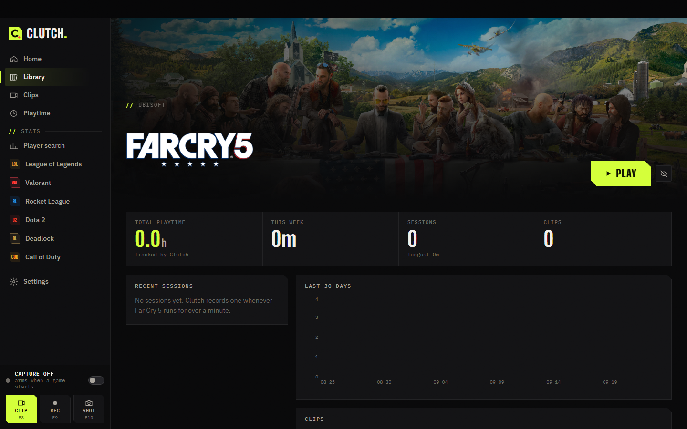
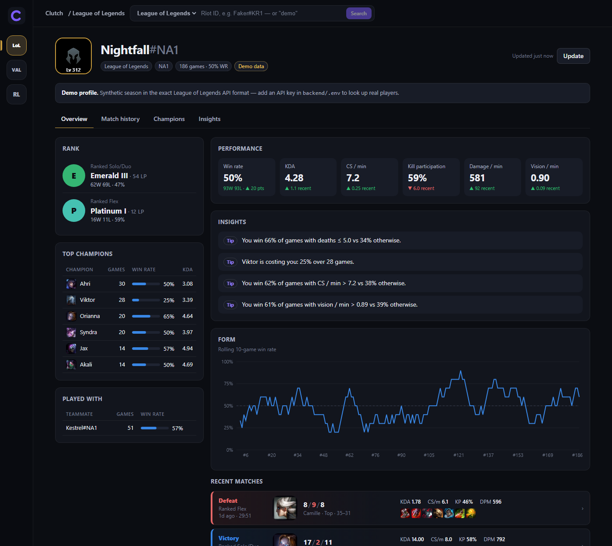
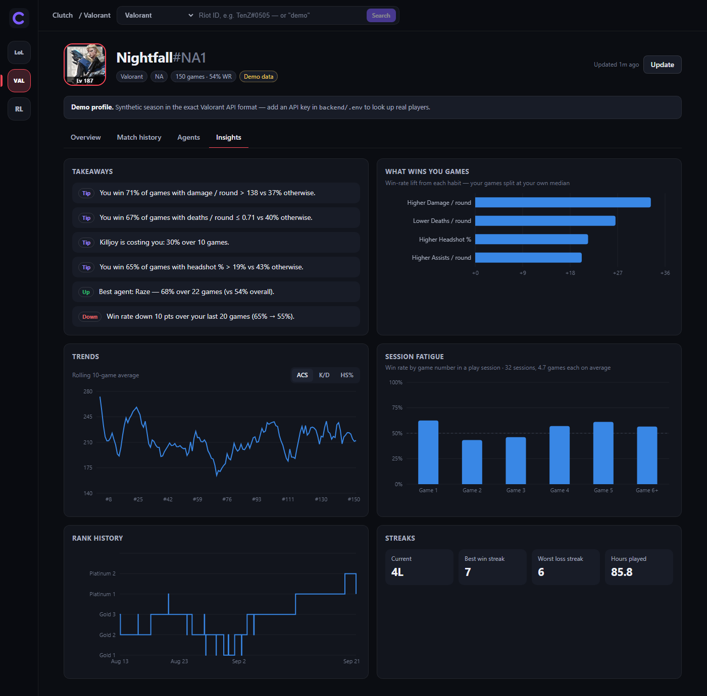
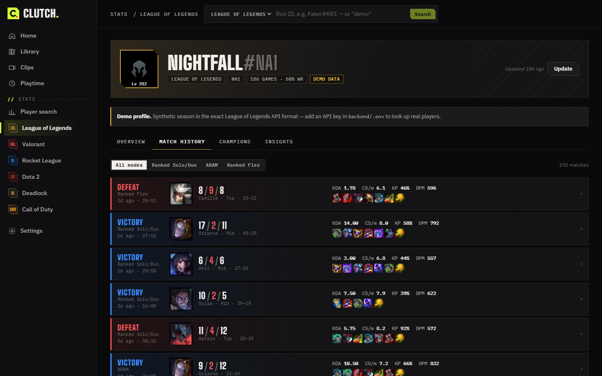
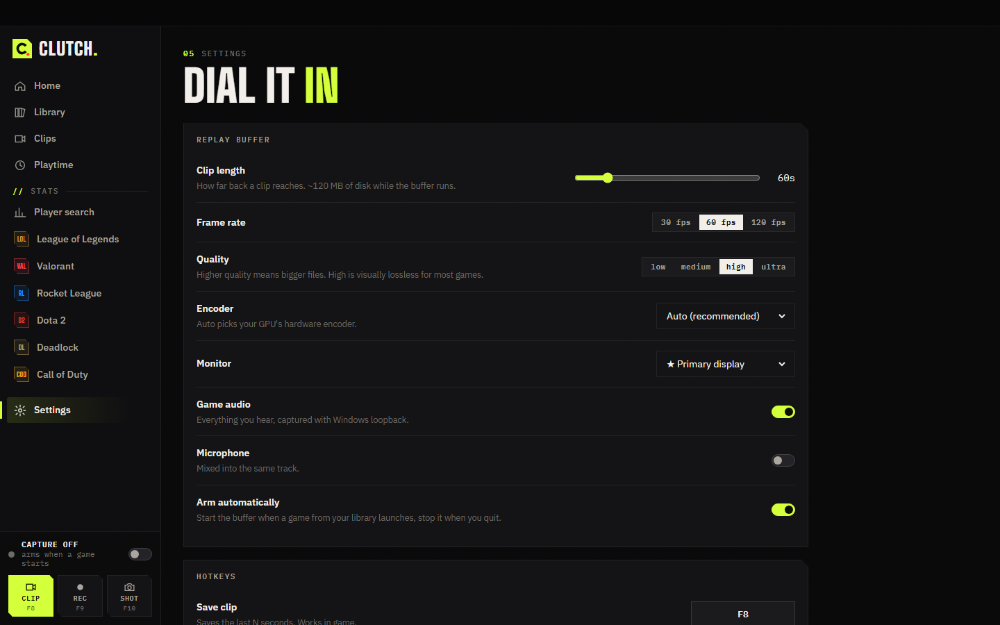
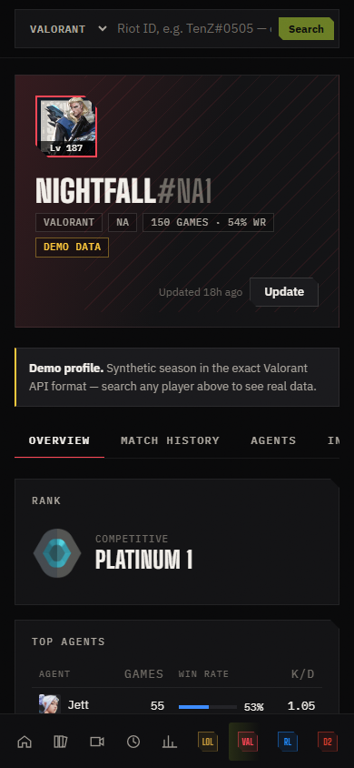

# Clutch — launcher, clipper and stats hub for PC gamers

Clutch is a desktop app in the spirit of Blitz.gg and Medal, in one place:

- **Launcher.** Finds every game you have installed across Steam, Epic, Riot, Battle.net, Ubisoft Connect, EA, Rockstar and Xbox, with official cover art, and launches any of them in one click.
- **Clipping.** A GPU replay buffer runs while you play. Press **F8** and the last 15–300 seconds are saved with game audio (and mic if you want). **F9** records, **F10** screenshots. A toast confirms it over your game.
- **Auto-clip.** Kills, multikills and aces are clipped for you in League of Legends (Riot's Live Client Data API), Dota 2 and Counter-Strike 2 (Valve Game State Integration, set up with one click).
- **Media hub.** Every clip in one place: hover-scrub previews, frame-accurate trimming, GIF export, a "fits in Discord's 10 MB" export, captions, 9:16 vertical exports, montages, a copy without your mic (separate audio tracks), and share links. Clips link to the match they were recorded in.
- **Playtime & sessions.** Every session is tracked automatically: totals, streaks, a 26-week heatmap, and a report card per session (W/L, form vs. usual, MVP game) when the game's account is linked.
- **Goals & friends.** Daily caps, practice hours, clip counts, win-rate and rank goals. A friends feed built from your friends' public stats profiles.
- **In game.** A click-through session panel (time, today's record, daily cap, what's playing) and Discord Rich Presence.
- **Music.** See and control Spotify, Apple Music, YouTube Music (or anything else in Windows' media controls) from Clutch: album art, seek, shuffle / repeat, per-app volume, launch buttons, media hotkeys that work over games, and optional ducking that turns music down while a game runs. No sign-in or API key.
- **Stats.** Match history, rank climbs and plain-English insights on *what separates your wins from your losses* for 14 games: League of Legends, Valorant, Counter-Strike 2 (FACEIT), Rocket League, Dota 2, Deadlock, Teamfight Tactics, PUBG, Brawl Stars, Clash Royale, osu!, Chess.com, Lichess and (experimentally) Call of Duty. Link your accounts and your stats refresh on their own after every session.



| Library & launcher | Game page |
|---|---|
|  |  |

| Stats: player profile | Insights: habits that win games |
|---|---|
|  |  |

| Match history | Capture settings | Mobile (web) |
|---|---|---|
|  |  |  |

Every stats game has a **demo profile**: a synthetic season generated in that game's exact API format, so the whole stats side works without API keys.

## Quick start

```bash
# 1. backend (Python 3.10+)
cd backend
python -m venv .venv && .venv\Scripts\activate         # macOS/Linux: . .venv/bin/activate
pip install -e ../rl-stat-tracker -e ".[desktop,dev]"

# 2. frontend (Node 20+)
cd ../frontend && npm install && npm run build

# 3a. the desktop app (Windows)
cd ../desktop && npm install && npm start

# 3b. or just the stats site in a browser
cd ../backend && clutch serve                           # http://127.0.0.1:8000
```

The desktop app starts the backend for you and lives in the tray. Closing the window keeps it running; quit from the tray icon. On first launch a short setup walks through hotkeys, clip length, quality and accounts.

### Windows installer

```bash
cd backend && pip install -e ".[desktop,build]"   # + PyInstaller
cd ../desktop && npm run dist                           # -> desktop/dist/Clutch-Setup-<version>.exe
```

`npm run dist` freezes the backend with PyInstaller (FFmpeg and PortAudio included), builds the frontend and packages both with electron-builder into an NSIS installer. Installed builds keep their data, API keys (`.env`) and stats database in `%APPDATA%\Clutch`, and check for updates in the background with electron-updater: a new version downloads silently and installs on the next restart.

Releases come from `.github/workflows/clutch-release.yml`: push a tag `clutch-v<version>` matching `desktop/package.json` and a Windows runner builds the installer and publishes it, with the `latest.yml` the updater reads, to the public `ak-77-dev/clutch-releases` repo (needs a `CLUTCH_RELEASES_TOKEN` secret). The installer isn't code-signed, so Windows SmartScreen warns on first run.

### Hotkeys

| Key | Action |
|---|---|
| **F8** | Save the last *N* seconds (default 60) |
| **F9** | Start / stop a full recording |
| **F10** | Screenshot |
| **Alt+O** | Show / hide the in-game session panel |
| **Ctrl+Alt+P** / **Ctrl+Alt+→** / **Ctrl+Alt+←** | Music: play-pause / next / previous (a toast over the game says what's on) |

All of them can be rebound in **Settings** by pressing the new key combo. They're global, so they work while a game has focus.

### Stats API keys

Paste keys in **Settings → API keys** (they're written to the `.env` next to the database), or copy `backend/.env.example` to `backend/.env`:

| Game | Key | Where |
|---|---|---|
| League of Legends | `RIOT_API_KEY` (+ `LOL_PLATFORM`, default `na1`) | [developer.riotgames.com](https://developer.riotgames.com). Dev keys expire every 24h. |
| Valorant | `HENRIK_API_KEY` | [HenrikDev API](https://docs.henrikdev.xyz). Riot's official Valorant match API is limited to approved production apps. |
| Rocket League | `BALLCHASING_API_KEY` | [ballchasing.com/upload](https://ballchasing.com/upload) |
| Dota 2 | none (optional `OPENDOTA_API_KEY` lifts the 60 req/min cap) | [OpenDota](https://docs.opendota.com). The player needs "Expose Public Match Data" on in the Dota client. |
| Deadlock | none | [deadlock-api.com](https://api.deadlock-api.com/docs) |
| Teamfight Tactics | `RIOT_API_KEY` (the same key) | Top 4 counts as a win; the "comp" is your strongest trait. |
| Counter-Strike 2 | `FACEIT_API_KEY` | [developers.faceit.com](https://developers.faceit.com) → an app → a *server-side* key. Valve publishes no CS2 match history, so this is FACEIT matches. |
| PUBG | `PUBG_API_KEY` (+ `PUBG_SHARD`, default `steam`) | [developer.pubg.com](https://developer.pubg.com). Top 10 counts as a win; the API keeps 14 days of matches. |
| Brawl Stars | `BRAWLSTARS_API_KEY` | [developer.brawlstars.com](https://developer.brawlstars.com). Supercell keys are locked to the IPs you list, so use your home IP. The battle log holds 25 battles; syncing after each session builds the history. |
| Clash Royale | `CLASHROYALE_API_KEY` | [developer.clashroyale.com](https://developer.clashroyale.com). Same IP rule. |
| osu! | `OSU_CLIENT_ID` + `OSU_CLIENT_SECRET` | An OAuth app at [osu.ppy.sh/home/account/edit](https://osu.ppy.sh/home/account/edit). Recent plays cover 24 hours, so history grows as Clutch syncs; the first sync adds your top 100. |
| Chess.com, Lichess | none | Public APIs. Openings are the "characters": the pool view shows which ones win for you. |
| Call of Duty (experimental) | `COD_SSO_TOKEN` (+ `COD_TITLE`, default `bo7`) | Your own `ACT_SSO_COOKIE` from callofduty.com. Activision has no public API. See below. |

Optional extras, also in Settings: a free [SteamGridDB](https://www.steamgriddb.com/profile/preferences/api) key for cover art on non-Steam games, and a Discord application ID for Rich Presence (create one at [discord.com/developers](https://discord.com/developers/applications) and name it "Clutch": Discord shows "Playing Clutch").

**About Call of Duty.** Activision only opens its stats API to partners. The adapter talks to callofduty.com's own endpoints, signed in as *you* with your session cookie. It's built from those endpoints' documented shape and tested against demo data, but not yet against live responses, so treat it as experimental. Launching, playtime and clipping for CoD don't need any of this.

## How it works

```
desktop/   Electron: spawns the backend, window + tray, global hotkeys, in-game toast overlay
   │  loads http://127.0.0.1:<random port> with a per-launch token
frontend/  React 19 + TypeScript + Vite + Recharts (fonts bundled, works offline)
   │  /api/*  (JSON + Server-Sent Events)
backend/   FastAPI
   app.py            REST API + serves frontend/dist
   service.py        stats: lookup → incremental sync → read models
   analytics.py      game-agnostic summaries, trends, streaks, tilt, win factors, insights
   games/            one adapter per game (Riot, HenrikDev, ballchasing, OpenDota, deadlock-api, CoD)
   local/            desktop mode only
     library.py      launcher scanners + launch recipes
     art.py          Steam cover-art matching, exe icon extraction, accent colours
     playtime.py     process monitor → sessions
     capture.py      replay buffer, recording, screenshots (FFmpeg + WASAPI)
     clips.py        media hub index, trim, GIF, size-capped export
     edit.py         montage, captions, 9:16, remove the mic track
     autoclip.py     highlight detection: Riot Live Client API, Valve GSI (Dota 2, CS2)
     reports.py      session report cards
     goals.py        goals and their progress
     friends.py      friends feed (public stats profiles)
     share.py        share-link uploads (catbox / litterbox)
     storage.py      auto-cleanup by age / size (favorites kept)
     keys.py         API keys from the Settings page
     media.py        music: Windows media sessions (WinRT), per-app volume (Core Audio), launching music apps
     desktop.py      glue: auto-arm, session recaps, auto stats refresh, event bus
     api.py          /api/desktop/* (token-guarded)
desktop/discord.js   Discord Rich Presence over Discord's local IPC pipe (no dependency)
```

### The launcher

Nothing is guessed. Each launcher's own on-disk state is read:

| Source | Read from | Launch |
|---|---|---|
| Steam | `libraryfolders.vdf` + `appmanifest_*.acf` (a small VDF parser) | `steam://rungameid/<id>` |
| Epic | `ProgramData/Epic/.../Manifests/*.item` (DLC filtered out) | `com.epicgames.launcher://apps/<ns>:<item>:<app>` |
| Riot | `ProgramData/Riot Games/Metadata/*/product_settings.yaml` | `RiotClientServices.exe --launch-product=…` |
| Xbox / Game Pass | `<drive>:/XboxGames/*/Content/MicrosoftGame.config` | `shell:AppsFolder\<family>!<app id>` |
| Battle.net, Ubisoft, EA, Rockstar | the Windows uninstall registry, matched by each launcher's uninstaller signature | `Battle.net.exe --exec="launch <code>"`, `uplay://launch/<id>`, the game exe |

Games found by several sources are deduplicated by install folder. Stale entries whose folder is gone are dropped, and known always-running non-games (Wallpaper Engine, SteamVR, OBS…) are hidden so they don't count as playtime. Cover art comes from Steam's CDN, and non-Steam games are matched by exact title against Steam's store search. Anything else gets a designed tile with the game's real icon, extracted from its exe.

### Clipping

- **Video.** One long-running FFmpeg grabs the screen with the Desktop Duplication API (`ddagrab`) and encodes on the GPU in H.264, HEVC or AV1. The first of NVENC → AMF → Quick Sync that actually initializes is used, with x264/x265 on the CPU as the fallback. It writes 1-second MPEG-TS segments with a keyframe every second into a spool folder. Options: constant quality (low → max) or a target bitrate, 30–144 fps, native/1440p/1080p/720p, and encoder effort (speed / balanced / quality with multipass). Temporal AQ and lookahead stay off on purpose: they make NVENC hold frames back, which broke A/V timing in testing.
- **Audio.** WASAPI loopback (and optionally the mic) is spooled as raw PCM on a wall-clock timeline, and at the same time encoded to AAC by a live encoder in 1-second segments. Windows sends *no* loopback packets while nothing is playing, so silence is filled in by timestamp. A watchdog follows the default device (Bluetooth headsets switch endpoints whenever a mic turns on) and reopens streams that go quiet, because a WASAPI stream on an invalidated device stops delivering without an error. That silent failure is what produced silent clips before the watchdog existed.
- **Saving.** A clip is the last N video segments streamed into one MPEG-TS input (TS joins byte-for-byte; the concat demuxer cost ~35 ms per segment) plus the already-encoded AAC. Both are stream-copied, so a clip saves in **~0.4 s** in the running app. The hotkey's sound and toast fire on the key press itself, not when the file is done.
- **Sync.** Video segments are timed by creation time, corrected for a measured 45 ms pipeline delay (flash + click test: **±10 ms**). Stream-copied AAC can only start on a 1024-sample frame, so whole segments are used and the track is shifted by the exact amount, with the MP4 edit list hiding the lead-in (tested offline: −1.3 ms). The measured 2048-sample AAC delay is included.
- **Separate tracks.** With the mic on and *Separate audio tracks* enabled, clips carry three tracks: game + mic (what players hear), game only, and mic only. Editors see all three, and "Copy without my mic" keeps just the game.
- **Auto-clip.** Highlights are saved a few seconds *after* the play, so the clip covers the run-up and the kill. A burst of kills (a triple, an ace) becomes one longer clip, not several. Valorant, Rocket League and CoD publish no live kill data, so they rely on the hotkey.
- **Crash safety.** FFmpeg is bound to the backend with a Windows Job Object (`KILL_ON_JOB_CLOSE`), so a crashed backend can't leave a recorder filling the disk. Startup also sweeps for stray recorders from older runs, and the backend locks its data folder so only one copy ever runs: the app adopts a twin that answers with its launch token, or stops a leftover from an earlier launch and starts fresh.

### Music

Windows keeps a list of media sessions for every app that uses its media controls, the same list behind the volume flyout and keyboard media keys. Clutch reads that list through WinRT (`GlobalSystemMediaTransportControlsSessionManager`) on a worker thread: title, artist, album art, position and which controls the app allows. It can then play, pause, skip, seek, shuffle and repeat. That covers Spotify, the Apple Music app, YouTube Music (the Chrome web app is recognised by its app id; a browser tab shows as the browser) and most other players, with no accounts. Volume uses Core Audio sessions, which are per process, so YouTube Music in Chrome shares Chrome's volume.

### Security

The desktop API can launch programs and delete files, so:
- it only exists in desktop mode and only binds to `127.0.0.1`;
- every request needs a random per-launch token that only the Electron shell and its window know. This stops any web page you visit from sending requests to your local Clutch (localhost CSRF);
- launching only works for games in your library, never an arbitrary path;
- deletes go to the Recycle Bin;
- share links are the only uploads, only on a click, and the app says the upload is public before it happens. Friends are public profiles fetched from the same stats APIs; Clutch has no server of its own.

The Electron window runs sandboxed with context isolation. Links to other sites open in your browser.

### Stats engine

- **One analytics engine for every game.** Adapters emit a normalized `Match`, and each game declares its metrics in a `GameMeta`: labels, formats, headline KPIs, and the process stats to test against win rate. Neither the analytics nor the UI have per-game code, so each game is one adapter file (about 150–300 lines) plus a demo generator. Win factors only use stats you control: a game's own outcome measures (TFT rounds survived, PUBG time alive, chess game length) are left out so insights don't just restate the result.
- **Raw-first storage.** Upstream JSON is stored and parsed on read, so parser fixes apply to all history, and sync never re-downloads a match. Adapters keep only what they parse: a Deadlock match is ~1.7 MB upstream and ~5 KB stored.
- **Respectful API usage.** A multi-window sliding rate limiter (Riot's 20/s *and* 100/2 min). 429s honor `Retry-After` or HenrikDev's `x-ratelimit-reset`. Upstream failures map to clean error messages.
- **Honest analytics.** Remakes and kill-target modes (Deathmatch) are excluded from per-round stats. Insights need a minimum sample, and win factors split at the player's *own* median.

## Development

```bash
cd backend  && pytest --cov=clutch && ruff check . && ruff format --check .   # 120 tests
cd frontend && npm test && npm run typecheck && npm run build
cd desktop  && npm run check                                                  # syntax + node:test
```

CI runs the backend suite on Linux and Windows, plus the frontend and desktop checks. OpenAPI docs are served at `/api/docs`.

**Adding a stats game:** implement `GameProvider` in `backend/clutch/games/<game>.py` with its `GameMeta`, add a demo generator in the upstream API's shape, and register it in `games/__init__.py`. The UI picks it up from `/api/games`.

**Adding a launcher:** write a `scan_<launcher>()` in `local/library.py` that returns `Game`s with an install folder and a launch recipe, and add it to `DEFAULT_SCANNERS`.
