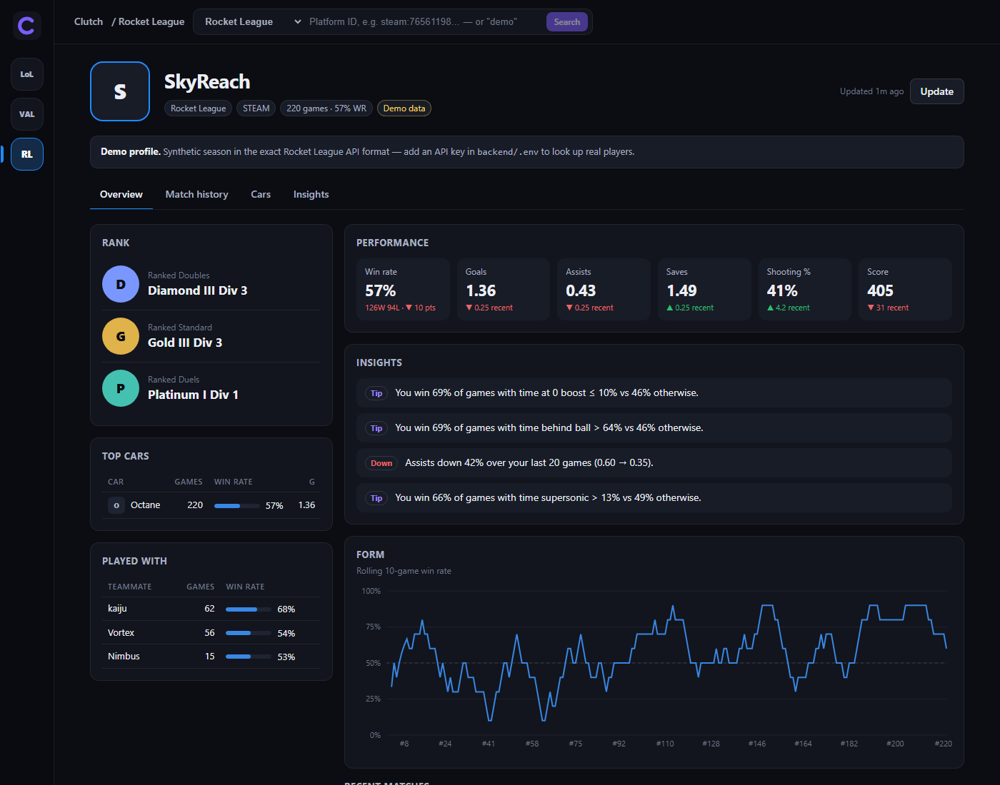

# Clutch — a multi-game stats hub

A Blitz.gg-style tracker for **League of Legends**, **Valorant** and **Rocket League**. Look up any player to get:
- match history with full scoreboards
- their champion / agent / car pool
- rank progression
- trends over time
- plain-English insights on **what actually separates their wins from their losses**


| Match history with scoreboards | Insights: habits that win games |
|---|---|
|  |  |

| Rocket League | Mobile |
|---|---|
|  |  |

Every game has a **demo profile**: a synthetic season generated in that game's exact API format. The whole app works without API keys, and the same code path is used for real players once keys are added.

## Quick start

```bash
# backend (Python 3.10+)
cd clutch/backend
python -m venv .venv && . .venv/bin/activate          # Windows: .venv\Scripts\activate
pip install -e ../../rl-stat-tracker -e ".[dev]"      # rlstats powers the Rocket League adapter

# frontend (Node 20+)
cd ../frontend && npm install && npm run build

# run: the API serves the built frontend
cd ../backend && clutch serve                          # http://127.0.0.1:8000 → "Try the demo profile"
```

For frontend development, run `clutch serve` alongside `npm run dev` in `frontend/` (Vite proxies `/api` to :8000).

### Live data

Copy `backend/.env.example` to `backend/.env` and add whichever keys you have:

| Game | Key | Where |
|---|---|---|
| League of Legends | `RIOT_API_KEY` (+ `LOL_PLATFORM`, default `na1`) | [developer.riotgames.com](https://developer.riotgames.com). Dev keys expire every 24h. |
| Valorant | `HENRIK_API_KEY` | [HenrikDev API](https://docs.henrikdev.xyz). Riot's official Valorant match API is limited to approved production apps. |
| Rocket League | `BALLCHASING_API_KEY` | [ballchasing.com/upload](https://ballchasing.com/upload) |

Search with a Riot ID (`Name#TAG`) for League/Valorant, or a platform ID (`steam:7656…`, `epic:…`) for Rocket League. The first lookup downloads recent matches; the **Update** button pulls only new ones.

## Architecture

```
frontend/  React 19 + TypeScript + Vite + Recharts
   │  /api/*  (JSON)
backend/   FastAPI
   app.py        REST API + serves frontend/dist (SPA fallback)
   service.py    lookup → incremental sync → read models (memoized parsing)
   analytics.py  game-agnostic: summaries, trends, streaks, sessions/tilt, character pool,
                 teammates, rank history, median-split win factors, insights
   store.py      SQLite: raw upstream JSON (source of truth) + profile aliases
   http.py       JSON client: multi-window sliding rate limiter, retries/backoff, error mapping
   games/
     base.py          GameProvider interface (resolve, list/fetch matches, parse, demo)
     league.py        Riot account-v1, summoner-v4, league-v4, match-v5 + Data Dragon art
     valorant.py      HenrikDev v1/v2/v3 + valorant-api.com agent/map/rank art
     rocketleague.py  ballchasing.com via the rlstats package (../rl-stat-tracker)
     demo_data.py     deterministic seasons in the exact upstream JSON shapes
```

Design decisions worth calling out:

- **One analytics engine for every game.** Adapters emit a normalized `Match` (result, character, role, map, a flat `metrics` dict). Each game declares its metrics in a `GameMeta`: labels, formats, which stats are headline KPIs, and which are process stats tested against win rate. The analytics engine and the UI read that metadata, so adding a game touches neither.
- **Raw-first storage.** Upstream match JSON is stored as-is and parsed on read. Parser fixes apply to all history retroactively, and sync never re-downloads a match. A match is stored once and linked to every tracked player in it.
- **Respectful API usage.**
  - Riot dev keys allow 20 req/s *and* 100 req/2 min. `SlidingWindowLimiter` enforces every window at once, and it's thread-safe because FastAPI runs sync handlers in a pool.
  - 429s honor `Retry-After`.
  - Upstream failures map to clean `{error, message}` responses and never leak raw upstream errors.
- **Honest analytics.**
  - Remakes are excluded.
  - Insights only appear past sample-size thresholds.
  - Win factors split each player's games at *their own* median.
  - Outcome stats (goals, score) aren't treated as "habits".
- **Demo data with real cause and effect.** The generators use the official asset IDs (Data Dragon, valorant-api.com), and the stats are built so farming, vision, headshot rate and fatigue really move win rate. The insights engine has something true to find, and the tests assert it does.

## Development

```bash
cd backend && pytest --cov=clutch && ruff check . && ruff format --check .   # 30 tests, ~89% coverage
cd frontend && npm test && npm run typecheck && npm run build
```

API docs (OpenAPI) are served at `/api/docs`.

### Adding a game

1. Implement `GameProvider` in `backend/clutch/games/<game>.py`, including its `GameMeta`.
2. Add a demo generator in the upstream API's shape.
3. Register it in `games/__init__.py`.

The frontend picks it up from `/api/games`.
