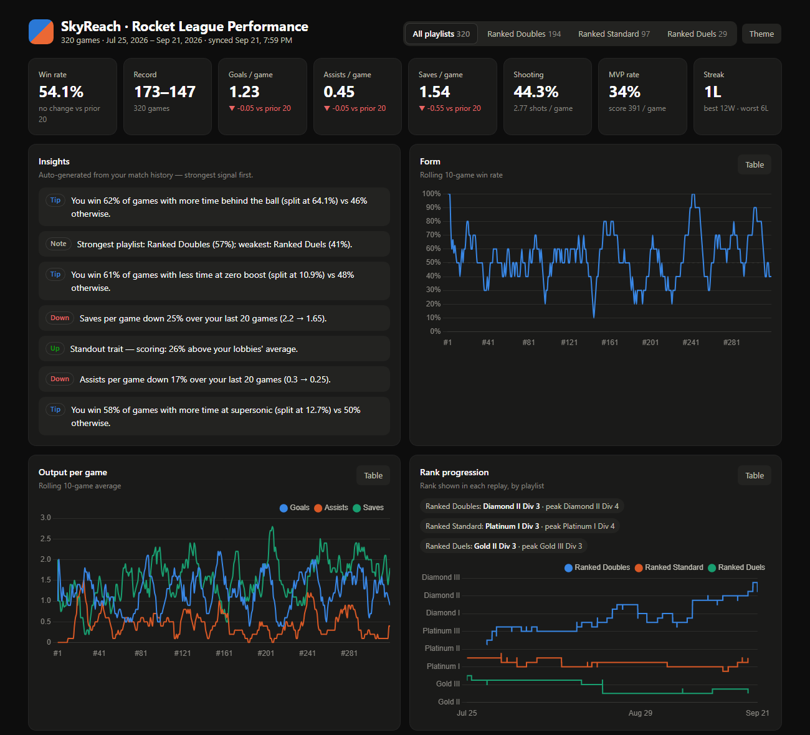
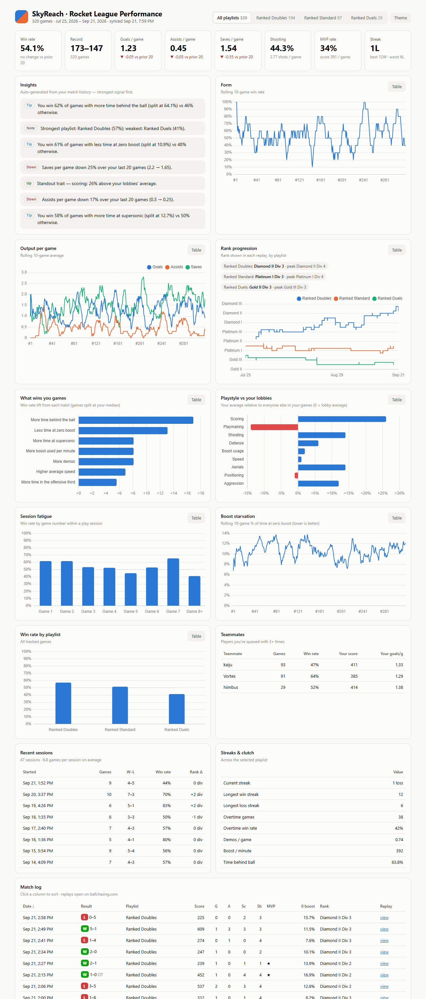

# rlstats — Rocket League performance analytics

Turns your [ballchasing.com](https://ballchasing.com) replay history into an interactive performance dashboard. Beyond the raw stats, it finds the **habits that actually win you games**, tracks **rank progression**, detects **session fatigue**, measures **duo chemistry**, and profiles your **playstyle against the players in your lobbies**.



**Try it with no account:** `rlstats demo --open` generates a realistic synthetic season and opens the dashboard. A prebuilt copy lives at [`docs/demo.html`](docs/demo.html).

## Features

- **Incremental sync.** Only downloads replays you haven't stored yet, and stops once it reaches history it has already seen. Rate-limited to ballchasing's free tier, with automatic retry and backoff on 429/5xx (honors `Retry-After`).
- **Reliable identity.** Matches you by platform ID (`steam:…`, `epic:…`), not display name, so renames and name collisions don't corrupt stats. It auto-detects the API key owner on first sync.
- **Raw-first storage.** Replay JSON is stored untouched in SQLite and parsed on read. Parser improvements apply to your whole history without re-downloading.
- **Insights engine.** Plain-English takeaways, each gated on sample size:
  - "You win 62% of games with less time at zero boost vs 48% otherwise"
  - win-rate and output trends over your last 20 games
  - best duo partner
  - strongest and weakest playlist
  - late-session fatigue
  - standout traits vs your lobbies
- **Analytics:**
  - rolling form
  - rank history per playlist
  - win/loss streaks
  - play sessions and a win-rate-by-game-number "tilt curve"
  - teammate win rates
  - median-split win factors
  - playstyle index vs lobby averages
- **Dashboard.** A single self-contained HTML file:
  - playlist filter, KPI cards with trend deltas, and 8 charts
  - sortable, paginated match log that links to each replay
  - light/dark themes and a mobile layout
  - a table view for every chart (accessibility)
  - an `--offline` build that works without internet
- **CLI tooling.** `sync`, `dashboard`, `report` (terminal summary), `export` (CSV for pandas/Excel), `demo` and `whoami`.
- **Engineering.** 40 tests (~94% coverage), `ruff` lint and format, and GitHub Actions CI on Python 3.10, 3.12 and 3.13.

<details>
<summary>Full dashboard (light theme)</summary>


</details>

## Quick start

```bash
cd rl-stat-tracker
python -m venv .venv && . .venv/bin/activate    # Windows: .venv\Scripts\activate
pip install -e ".[dev]"

rlstats demo --open            # synthetic season, no API key needed
```

### With your own replays

1. Log into [ballchasing.com](https://ballchasing.com) and copy your API token from https://ballchasing.com/upload.
2. `cp .env.example .env` and set `BALLCHASING_API_KEY`. Leave `RL_PLAYER_ID` empty to track the account that owns the key, or set it to `platform:id` to track anyone.
3. Get replays onto ballchasing:
   - **Going forward:** install [BakkesMod](https://bakkesplugins.com/) and enable ballchasing auto-upload.
   - **Past games:** drag `.replay` files from `Documents\My Games\Rocket League\TAGame\Demos` onto the upload page.
4. Sync and build the dashboard:

```bash
rlstats sync --open                    # download new replays + rebuild dashboard.html
rlstats sync --source player           # every PUBLIC replay you appear in, not just your uploads
rlstats report                         # terminal summary + insights
rlstats report --playlist ranked-doubles
rlstats export -o matches.csv          # flat CSV for your own analysis
```

Re-run `rlstats sync` whenever you like. It only fetches what's new.

## How it works

```
ballchasing API ──► client.py ──► sync.py ──► store.py (SQLite, raw JSON)
 (rate limit,         (incremental,               │
  retry/backoff,       stop at known)             ▼
  pagination)                          parse.py  (raw replay → typed Match, found by platform id,
                                                  with lobby averages of every other player)
                                                  │
                                                  ▼
                                   analytics.py  (pure functions → JSON report, per playlist)
                                                  │
                                ┌─────────────────┼──────────────────┐
                                ▼                 ▼                  ▼
                       dashboard.py (HTML)   report.py (terminal)   cli export (CSV)
```

| Module | Responsibility |
|---|---|
| `rlstats/client.py` | ballchasing HTTP client: auth, client-side rate limiter, retries with backoff, pagination |
| `rlstats/sync.py` | Incremental sync; skips replays still processing (`status != ok`) and retries them next run |
| `rlstats/store.py` | SQLite store of raw replays plus metadata (tracked identity, last sync) |
| `rlstats/parse.py` | Replay → `Match` (≈40 fields: core, boost, movement, positioning, rank, teammates, lobby averages) |
| `rlstats/analytics.py` | Summaries, streaks, sessions, rank history, teammates, playstyle, win factors, insights |
| `rlstats/dashboard.py` + `templates/dashboard.html` | Self-contained HTML (Chart.js pinned with SRI; optional inlined build) |
| `rlstats/demo.py` | Deterministic synthetic season in the real API shape (used by the demo and the tests) |

### The analytics, briefly

- **Win factors.** For each process stat you control (time at zero boost, time behind the ball, supersonic time, boost per minute, …), games are split at your median and the win rates on each side are compared. Outcome stats like goals and shots are excluded on purpose, because they would just restate the result.
- **Playstyle index.** Your per-game average divided by the average of every other player in the same replays (×100). It answers "compared with the people I actually play against", not a global baseline.
- **Sessions.** A new session starts after 45 minutes without a game. The tilt curve is your win rate for game 1, 2, 3 … of a session.
- **Rank.** ballchasing's `{tier, division}` is flattened to `tier + (division − 1)/4`, so progression charts on one axis. Session rank changes are summed per playlist, because ranks in different playlists aren't comparable.
- **Guardrails.** Insights need 10+ games; win factors need 8+ games on each side of the split; teammate rows need 3+ games together.

## Development

```bash
pip install -e ".[dev]"
pytest --cov=rlstats        # 40 tests, no network needed
ruff check . && ruff format --check .
```

The old entry points still work: `python fetch_stats.py` is `rlstats sync --no-dashboard`, and `python build_dashboard.py` is `rlstats dashboard`.
